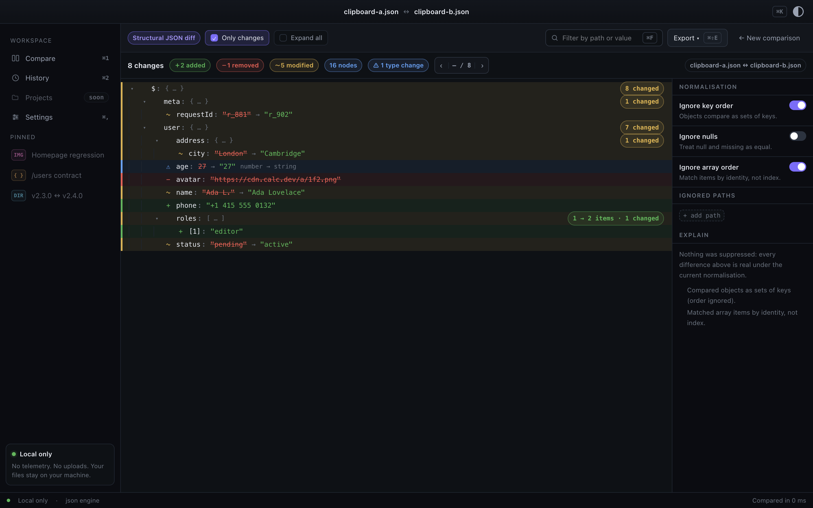
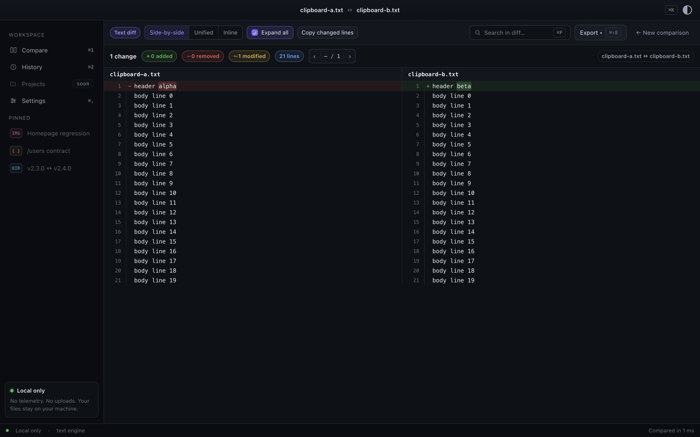
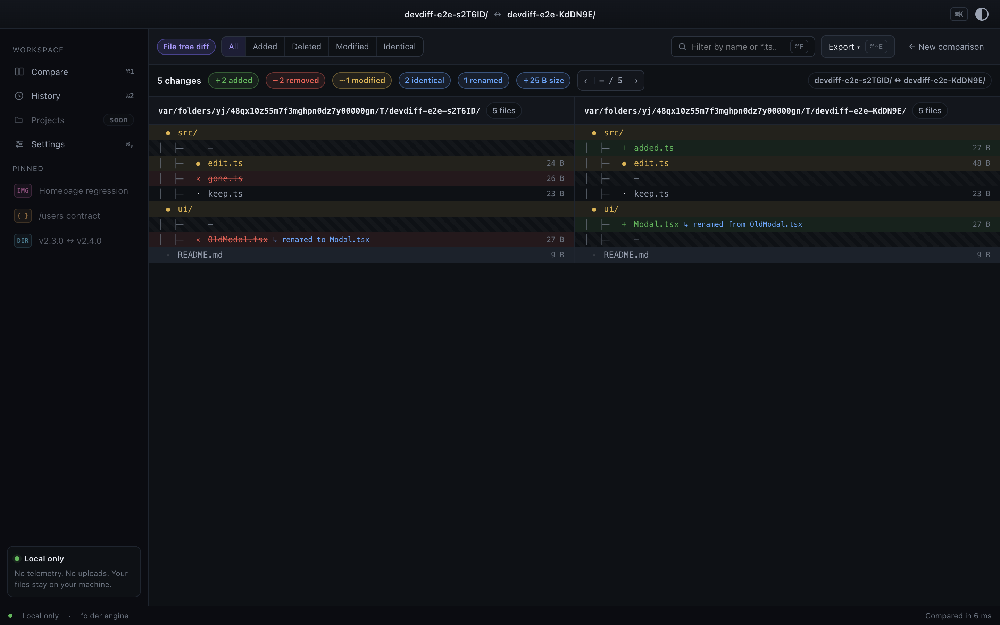
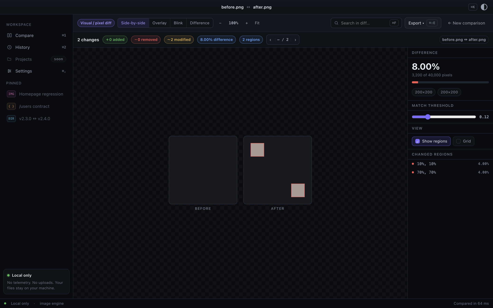
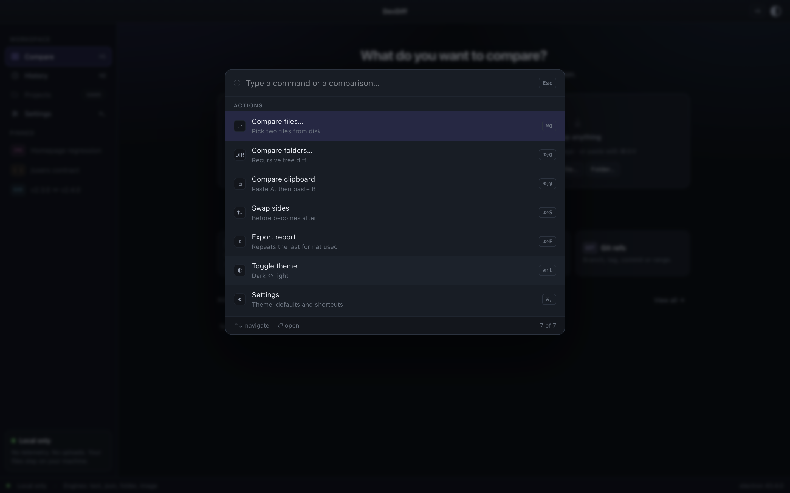

# TwinScope

**Compare anything. Understand what changed.**

📖 **[Documentation](https://codeaesthetic.github.io/twinscope-website/)** · [Download](https://codeaesthetic.github.io/twinscope-website/download/) · [Changelog](https://codeaesthetic.github.io/twinscope-website/changelog/)

A local-first universal comparison tool for developers. Drop two files, folders, images or clipboard contents — TwinScope detects what they are, picks the right diff engine, and shows what changed.

Your files never leave your machine: no telemetry, no uploads, no account.

> **Status: 0.1.0 released.** All five engines work, comparisons persist, and
> results export. The macOS builds are **unsigned** — macOS will refuse to open
> the app until you right-click → Open → Open. See
> [`docs/release.md`](docs/release.md) and the
> [install guide](https://codeaesthetic.github.io/twinscope-website/docs/getting-started/install/).



---

## What it does

|                   |                                                                                                                                                                   |
| ----------------- | ----------------------------------------------------------------------------------------------------------------------------------------------------------------- |
| **Text and code** | Side-by-side, unified and inline. Edited lines pair up and are marked word by word rather than appearing as unrelated deletes and adds. Long unchanged runs fold. |
| **JSON**          | A structural tree, not a line diff — reformat a file and nothing changes. Arrays match by identity, objects compare as key sets, type changes get their own row.  |
| **Folders**       | Recursive, with per-file status, rename pairing, filters, and drill-in to any file pair.                                                                          |
| **Images**        | Side-by-side, overlay, blink and difference, with changed regions boxed and an adjustable threshold.                                                              |
| **Binary**        | A verdict from sizes and a SHA-256, instead of pages of mojibake.                                                                                                 |

Every comparison opens with counts, then the detail. Normalisation is
explainable and reversible: anything hidden is counted, named, and one click
from coming back.

<details>
<summary>More screenshots</summary>






</details>

---

## Requirements

|          |                                                                   |
| -------- | ----------------------------------------------------------------- |
| **Node** | 24 (LTS) — `nvm use` picks it up from `.nvmrc`                    |
| **npm**  | 11+ (ships with Node 24)                                          |
| **OS**   | macOS, Windows or Linux. macOS is the primary development target. |

## Getting started

```bash
nvm use          # or: nvm install 24
npm install      # postinstall also fetches the Electron binary
npm run dev      # opens the app with hot reload
```

That's the whole setup. If `npm run dev` complains that Electron is missing, re-run `npm install` — see [Troubleshooting](#troubleshooting).

## Scripts

| Command                   | What it does                                                   |
| ------------------------- | -------------------------------------------------------------- |
| `npm run dev`             | Electron + Vite with hot reload                                |
| `npm run build`           | Production build into `out/`                                   |
| `npm run verify`          | Builds, boots the app, and checks it really works (Playwright) |
| `npm run typecheck`       | TypeScript across three projects: main/preload, renderer, e2e  |
| `npm test`                | Unit tests (vitest)                                            |
| `npm run lint`            | ESLint, including the import-boundary rules                    |
| `npm run format`          | Prettier                                                       |
| `npm run gate`            | Everything above, in the order CI runs it                      |
| `npm run package:mac`     | Builds `release/TwinScope-<version>.dmg`                       |
| `npm run verify:packaged` | Boots the packaged app and compares in it                      |
| `npm run icon`            | Regenerates `build/icon.png` from `scripts/make-icon.mjs`      |

## Layout

```
src/
├── main/       Electron main process — windows, security, IPC
├── preload/    the only bridge between renderer and main
├── renderer/   React UI
├── shared/     cross-process contracts (channel names, types)
└── engines/    comparison engines — pure logic, no Electron, no DOM
e2e/            verification harness (see below)
```

Three boundaries are enforced by ESLint rather than convention:

- The **renderer** cannot import `node:*` or `electron`. It talks to the main process only through `window.twinscope`, exposed by the preload script.
- **Engines** cannot import `electron`, so the planned CLI can reuse them unchanged.
- `src/shared/channels.ts` stays dependency-free, because the sandboxed preload imports it.

## Verifying changes

`npm run verify` is a harness, not a test suite. It builds the app, boots it in Electron, and gives you a real page to drive:

```ts
const harness = await launchApp();
await harness.page.getByTestId('…').click();
await harness.screenshot('what-i-changed');
expect(harness.errors).toEqual([]);
```

Screenshots land in `e2e/.artifacts/screenshots/`. Keep `e2e/verify.spec.ts` small — its security assertions are permanent; for one-off checks, write a throwaway spec and delete it after.

## Security posture

The renderer is treated as untrusted. `src/main/security.ts` enables the sandbox and context isolation, disables node integration, sets a Content-Security-Policy, and denies navigation, new windows, `<webview>` embedding and every permission request. `npm run verify` asserts these hold — a regression there is a remote-code-execution bug, not a UI bug.

## Troubleshooting

**"Electron failed to install correctly" / no window opens.** npm gates dependency install scripts, so Electron's own postinstall never runs and the binary is missing. `scripts/ensure-electron.mjs` handles this from the root `postinstall`; run `npm install`, or `node scripts/ensure-electron.mjs` directly.

**Don't bump Vite past 7 or TypeScript past 6.0.** `electron-vite` peers on Vite `^5 || ^6 || ^7`, and `typescript-eslint` peers on TypeScript `<6.1.0` — TypeScript 7 is the native compiler and has no lint support yet. These are the newest versions the whole toolchain agrees on.

## License

MIT

## Documentation

Full documentation lives at
**[codeaesthetic.github.io/twinscope-website](https://codeaesthetic.github.io/twinscope-website/)**
— every engine, every keyboard shortcut, what is stored and what never is, and a
screenshot or GIF of each feature captured from the running app.

Its source is [`codeAesthetic/twinscope-website`](https://github.com/codeAesthetic/twinscope-website).
The screenshots are produced from this repo by `npm run capture`, so re-run it
after any UI change rather than editing images by hand.
